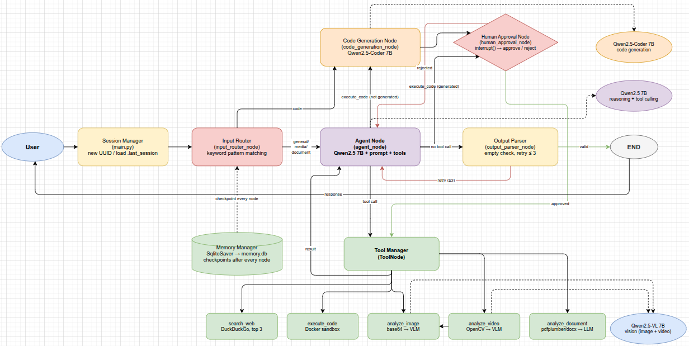

# Design phase

## Agent flow — how a message is processed end to end

1. **Input routing**: a design pattern used to dynamically direct user input to the most appropriate processing path, model, or specialized agent based on the content of the request
2. **Memory retrieval**: agent fetches conversation history from local sqlite hosted DB that persist data even after system crashes
3. **Reasoning step (LangGraph node)**: LangGraph orchestrates 
   the agent loop as a graph. Each node is a component, each 
   edge is a conditional connection. LangGraph's SqliteSaver 
   checkpoints state at every step to SQLite.
4. **Tool selection**: if tool needed, agent selects between:
   - Web search tool: triggered when user asks or web search needed
   - Code execution tool: triggered when user asks or automation needed
   - Vision tool: triggered when input is image/video
5. **Tool execution**: the process of actively running a defined tool—such as a Python function, API call, or database query—after a LLM has decided it needs that tool to answer a user's request
6. **Output parsing + validation**: techniques used to transform raw, unstructured text from LLMs into structured, machine-readable formats like JSON, Python objects, or lists
7. **Memory update**: result stored back to sqlite local db
8. **Response to user**: plain human readable text or image/video

## On memory and storage
- What database / storage mechanism will you use and why?
  sqlite local db because its better than ConversationBufferMemory that saves on RAM it prevents losing data history if any crash happens.
- What gets stored? (full message? summary? embeddings?)
  full message history (every user message 
  and agent response). Summarization considered as future 
  mitigation if context window is exceeded.
- When is history retrieved?
  Second step, after input routing.

## Known limitations
- ConversationBufferMemory rejected: stores history in RAM only, 
  lost on restart. SQLite chosen instead.
- SQLite limitation: if conversation history grows very large, 
  it may exceed the model's context window. 
  Future mitigation: summarization or sliding window.

## Components

| Component | Responsibility | Input | Output |
|-----------|---------------|-------|--------|
| Input Router | route the user request to its dedicated model/agent| text/image/video | chosen model/agent |
| Memory Manager |Persist and retrieve conversation history from SQLite |user message + thread ID (read) / agent response (write)| conversation history (read) / confirmation (write) |
| Agent (LangGraph graph) |orchestrate the full agent loop as a stateful graph with conditional edges | user message + conversation history | final response or tool call |
| Tool Manager | tool selection and execution| Agent's steps | tool result (text, code output, or image description) |
| Output Parser | structure model output into machine data and  validate agents answer | model output | understandable machine/human answer |

## Architecture

### Key design decisions reflected in the diagram
- Input Router sits first — separates text from vision before 
  anything else
- Memory Manager is called twice — retrieve before agent, 
  save after output parser
- Tool Manager is optional path — agent decides whether to 
  invoke it
- Ollama serves both models — swapped depending on task type
- Output Parser always runs — even if no tool was used